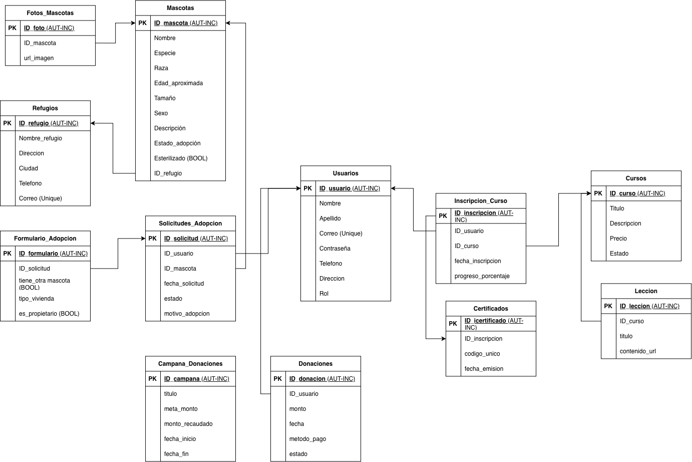

# 🐾 PetMind Backend

Backend de PetMind, una aplicación para gestionar información de mascotas, sus propietarios y su historial.

##  Descripción

PetMind es un proyecto desarrollado para centralizar y administrar la información relacionada con mascotas. El backend proporciona la lógica del sistema y se conecta a una base de datos PostgreSQL alojada en Neon.


##  Equipo y responsabilidades

| Integrante | Responsabilidades |
|---|---|
| **Santiago Varela** | Configuración de la conexión del backend con la base de datos PostgreSQL en Neon. Elaboración y actualización de la documentación técnica en el README, incluyendo la incorporación del diagrama de base de datos. |
|---|---|
| **Brayan Ciro** | Creación de las entidades JPA a partir del diagrama de base de datos. Implementación de las relaciones entre entidades y vinculación de las clases enumeradas con dichas entidades. |
|---|---|
| **Emmanuel Gómez** | Diseño inicial de la base de datos y elaboración del diagrama. Desarrollo de la clase base o clase padre, las clases embebidas y las enumeraciones del proyecto. |

##  Tecnologías

| Tecnología | Uso |
|---|---|
| Java 21 | Lenguaje principal |
| Spring Boot | Framework del backend |
| Spring Data JPA | Persistencia y acceso a datos |
| PostgreSQL | Base de datos |
| Neon | Alojamiento de la base de datos |
| Maven | Gestión de dependencias |
| GitHub | Control de versiones |

##  Estructura del proyecto

```text
src/
 ├── main/
 │   ├── java/         # Código fuente Java
 │   └── resources/    # Configuración de Spring Boot
 └── test/             # Pruebas del proyecto
```

##  Diagrama de base de datos



##  Requisitos

- Java 21 o superior
- Git
- Acceso a la base de datos Neon del proyecto

## Instalación y ejecución

Clona el repositorio:

```bash
git clone https://github.com/ciroescuderobrayan-SDJ/backend-pet-mind.git
cd backend-pet-mind
```

Ejecuta el proyecto:

```bash
sh mvnw spring-boot:run
```

El servidor iniciará en:

```text
http://localhost:8080
```


## Trabajo en equipo

1. Actualizar la rama `main`.
2. Crear una rama por cada tarea.
3. Probar los cambios localmente.
4. Subir la rama a GitHub.
5. Crear un Pull Request hacia el repositorio grupal.
6. Revisar los cambios antes de unirlos a `main`.

## Seguridad

- No compartir contraseñas de Neon.
- No subir archivos de configuración local.
- Coordinar con el equipo los cambios en la base de datos.

---
Proyecto académico · PetMind